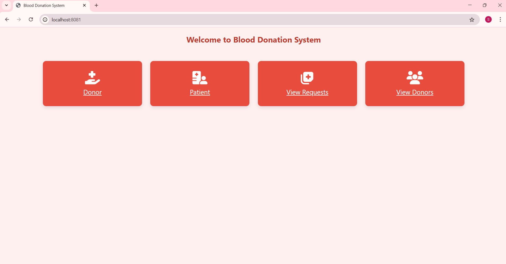
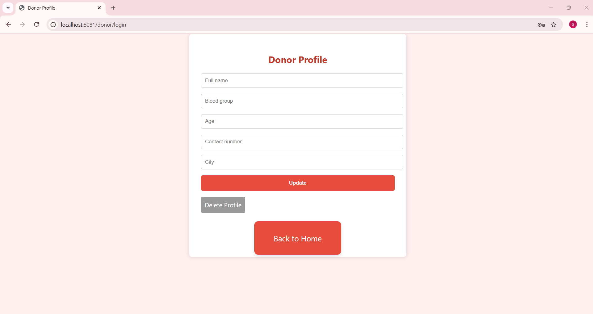
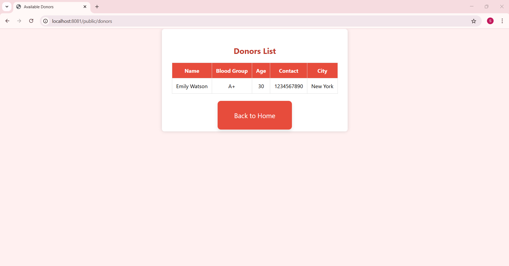
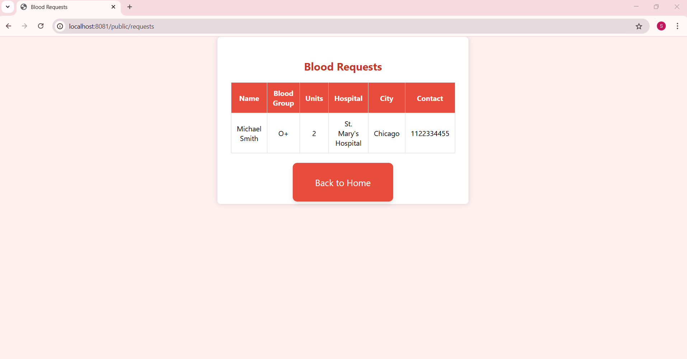

# 🩸 Blood Donation Management System
A modern web-based Blood Donation Management System 💉 built with Spring Boot and MongoDB, enabling Donors to register and Patients to request blood. The system is designed with an attractive UI, smooth navigation, and real-time data management.

# ✨ Features
👤 Donor & Patient Login/Register

📝 Form submission with validation

🔒 Password-protected login

📁 MongoDB-based data saving

🔁 Edit/Delete donor & patient profiles

🔍 Public pages for viewing:

🧑‍🤝‍🧑 Available Donors

🚨 Blood Requests

✅ Flash messages for success/error

🎨 Professional UI with Font Awesome icons

# 🛠️ Technologies Used

☕ Java + Spring Boot

🌿 MongoDB (NoSQL database)

🧠 Thymeleaf Template Engine

🎨 HTML + CSS

📦 Maven

## 📸 Screenshots

### 🏠 Home Page

### 📋 Request Profile Page

### 💉 Donor Profile Page

### 📜 Donor List View

### 🩸 Blood Requests View

